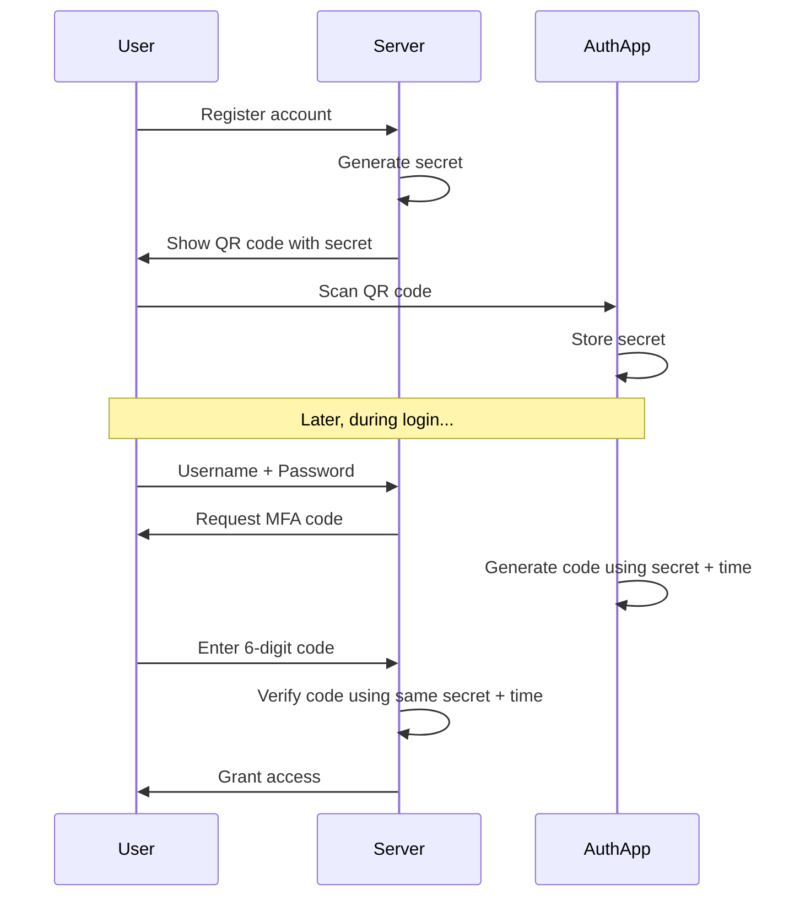

# Building a Multi-Factor Authentication System in Rust

## Table of Contents

- [Introduction to MFA](#introduction-to-mfa)
- [Understanding TOTP](#understanding-totp)
- [Project Setup](#project-setup)
- [Core Concepts](#core-concepts)
- [Building the Secret Generator](#building-the-secret-generator)
- [Generating TOTP Codes](#generating-totp-codes)
- [Verifying Codes](#verifying-codes)
- [QR Code Generation](#qr-code-generation)
- [Building a Complete Auth System](#building-a-complete-auth-system)
- [Security Considerations](#security-considerations)

---

## Introduction to MFA

### What is Multi-Factor Authentication?

Multi-Factor Authentication (MFA) adds an extra layer of security beyond just a password. It requires users to provide two or more verification factors:

1. **Something you know** (password)
2. **Something you have** (phone with authenticator app)
3. **Something you are** (biometric data)

In this tutorial, we'll implement **TOTP (Time-based One-Time Password)**, which is the "something you have" factor. This is what apps like Google Authenticator, Authy, and Microsoft Authenticator use.

### Why TOTP?

TOTP is popular because:

- It works offline (no network required after initial setup)
- It's standardized (RFC 6238)
- It's compatible with many authenticator apps
- It's more secure than SMS-based codes

---

## Understanding TOTP

### How TOTP Works

TOTP generates a new 6-digit code every 30 seconds using:

```
Code = HMAC-SHA1(Secret, Time) % 1,000,000
```

Let's break this down:

1. **Secret**: A random key shared between server and client (your app)
2. **Time**: Current Unix timestamp divided by 30 (the time step)
3. **HMAC-SHA1**: A cryptographic hash function
4. **% 1,000,000**: Reduces the hash to a 6-digit number

> [!NOTE]
> **Key Insight:** Both the server and the authenticator app use the **same secret** and **synchronized time** to generate identical codes. The secret never leaves either device.

### The Flow



---

## Project Setup

### Creating the Project

First, create a new Rust project:

```bash
cargo new mfa_tutorial
cd mfa_tutorial
```

### Understanding Dependencies

We need several crates. Let's understand what each one does:

#### Cargo.toml

```toml
[package]
name = "mfa_tutorial"
version = "0.1.0"
edition = "2024"

[dependencies]
totp-lite = "2.0"    # TOTP algorithm implementation
base32 = "0.5"       # Encoding secrets in Base32 format
rand = "0.9"         # Generating random secrets
qrcode = "0.14"      # Creating QR codes
```

**Why these crates?**

- **totp-lite**: Implements the TOTP algorithm (RFC 6238). We could write this ourselves, but cryptography is complex and error-prone.
- **base32**: Secrets must be Base32-encoded (characters A-Z and 2-7). This is human-readable and URL-safe.
- **rand**: Creates cryptographically secure random numbers for secrets.
- **qrcode**: Generates QR codes so users can easily scan with their phones.

> ### <span style="color: #e0ba4f;">WARNING</span>
> **Security Note:** Never use `rand::random()` for secrets! Always use `rand::thread_rng()` which is cryptographically secure.

---

## Core Concepts

### Secret Keys

The secret is the foundation of TOTP. Think of it as a shared password between your server and the user's authenticator app.

**Properties of a good secret:**

- At least 160 bits (20 bytes) of randomness
- Base32-encoded for compatibility
- Stored securely (encrypted in database)
- Unique per user

### Time Windows

TOTP uses 30-second time windows. Here's why:

- **Too short** (e.g., 10 seconds): Users might not have time to enter the code
- **Too long** (e.g., 60 seconds): Less secure, more time for attackers
- **30 seconds**: Sweet spot balancing usability and security

The current time window is calculated as:

```
time_step = current_unix_timestamp / 30
```

---

## Building the Secret Generator

### The Code

```rust
use rand::Rng;

fn generate_secret() -> String {
	let mut rng = rand::rng();
	let secret: Vec<u8> = (0..20).map(|_| rng.random()).collect();
	base32::encode(base32::Alphabet::Rfc4648 { padding: false }, &secret)
}
```

### Line-by-Line Explanation

**Line 1: Import the random number generator**

```rust
use rand::Rng;
```

This brings in the `Rng` trait, which adds the `.random()` method to our random number generator.

**Line 2: Get a thread-local random number generator**

```rust
let mut rng = rand::rng();
```

- `rng()` creates a cryptographically secure RNG
- `mut` because generating random numbers mutates its internal state
- Thread-local means each thread gets its own RNG (important for concurrency)

**Line 3: Generate 20 random bytes**

```rust
let secret: Vec<u8> = (0..20).map( | _ | rng.random()).collect();
```

Let's break this down further:

- `(0..20)` - Creates a range from 0 to 19 (20 iterations)
- `.map(|_| rng.random())` - For each iteration, generate a random byte (ignoring the index)
- `.collect()` - Gather all bytes into a `Vec<u8>`

> [!NOTE]
> **Why 20 bytes?** RFC 4226 (HOTP) recommends a secret of at least 128 bits (16 bytes). We use 160 bits (20 bytes) for extra security. More bytes = more entropy = harder to brute force.

**Line 4: Encode to Base32**

```rust
base32::encode(base32::Alphabet::Rfc4648 { padding: false }, & secret)
```

- Converts raw bytes to Base32 string
- `Rfc4648` is the standard alphabet (A-Z, 2-7)
- `padding: false` - We don't need padding characters ('=') for TOTP

**Example output:**

```
Raw bytes:  [0x1A, 0x2B, 0x3C, ...]
Base32:     "DJFM6YLQNFS..."
```

### Why Base32 and Not Base64?

Base32 is chosen for several reasons:

1. **Case-insensitive**: Only uppercase letters, easier for users
2. **No ambiguous characters**: Excludes 0, 1, 8, 9 (which look like O, I, B, g)
3. **URL-safe**: Can be used in QR code URLs without escaping
4. **Standard**: RFC 4648 specifies it for TOTP

---

## Generating TOTP Codes

### The Code

```rust
use totp_lite::{totp_custom, Sha1};

fn generate_totp(secret: &str) -> Result<String, String> {
	// Decode the Base32 secret
	let secret_bytes = base32::decode(
		base32::Alphabet::Rfc4648 { padding: false },
		secret
	).ok_or("Invalid secret")?;

	// Get current Unix timestamp
	let seconds = std::time::SystemTime::now()
		.duration_since(std::time::UNIX_EPOCH)
		.unwrap()
		.as_secs();

	// Generate the TOTP code
	let code = totp_custom::<Sha1>(30, 6, &secret_bytes, seconds);

	// Format as 6-digit string with leading zeros
	Ok(format!("{:06}", code))
}
```

### Understanding Each Part

#### Part 1: Decode the Secret

```rust
let secret_bytes = base32::decode(
base32::Alphabet::Rfc4648 { padding: false },
secret
).ok_or("Invalid secret") ?;
```

**What's happening:**

1. Takes the Base32 string (e.g., "JBSWY3DPEHPK3PXP")
2. Decodes it back to raw bytes
3. `.ok_or()` converts `Option` to `Result` with an error message
4. `?` propagates errors up if decoding fails

> [!TIP]
> **Error Handling Pattern:** This pattern is common in Rust:
>
> ```rust
> option.ok_or("error message")?
> ```
>
> It means "convert None to Error, or unwrap Some and continue."

#### Part 2: Get Current Time

```rust
let seconds = std::time::SystemTime::now()
.duration_since(std::time::UNIX_EPOCH)
.unwrap()
.as_secs();
```

**Breaking it down:**

1. `SystemTime::now()` - Current system time
2. `.duration_since(UNIX_EPOCH)` - Time elapsed since Jan 1, 1970 00:00:00 UTC
3. `.unwrap()` - We're confident this won't fail (current time is after 1970)
4. `.as_secs()` - Convert duration to seconds (u64)

**Example:**

```
Current time: February 3, 2026, 10:30:45 AM
Unix timestamp: 1770144645
Time step: 1770144645 / 30 = 59004821
```

#### Part 3: Generate the Code

```rust
let code = totp_custom::<Sha1>(30, 6, & secret_bytes, seconds);
```

**Parameters explained:**

| Parameter       | Value          | Meaning                 |
|-----------------|----------------|-------------------------|
| `<Sha1>`        | Type parameter | Hash algorithm to use   |
| `30`            | Time step      | Seconds per code window |
| `6`             | Digits         | Length of the code      |
| `&secret_bytes` | Secret key     | Shared secret           |
| `seconds`       | Current time   | Unix timestamp          |

> [!NOTE]
> **Why SHA-1?** Even though SHA-1 is broken for some uses, it's still secure for TOTP because:
>
> - We're using HMAC (not raw SHA-1)
> - Attackers can't predict future codes
> - It's the standard specified in RFC 6238
> - All authenticator apps support it

#### Part 4: Format the Output

```rust
Ok(format!("{:06}", code))
```

**What `{:06}` means:**

- `:0` - Pad with zeros
- `6` - Total width of 6 characters

**Examples:**

```rust
format!("{:06}", 123)    // "000123"
format!("{:06}", 456789) // "456789"
format!("{:06}", 7)      // "000007"
```

This ensures codes always have 6 digits, even if the number is small.

### The Complete Algorithm Flow

```
1. Decode secret:     "JBSWY3DPEHPK3PXP" → [raw bytes]
2. Get time:          1770144645 seconds
3. Calculate step:    1770144645 / 30 = 59004821
4. HMAC-SHA1:         HMAC(secret, 59004821) → [hash]
5. Truncate:          Extract 4 bytes from hash → 123456789
6. Modulo:            123456789 % 1000000 → 456789
7. Format:            456789 → "456789"
```

---

## Verifying Codes

### The Code

```rust
fn verify_totp(secret: &str, code: &str) -> Result<bool, String> {
	let secret_bytes = base32::decode(
		base32::Alphabet::Rfc4648 { padding: false },
		secret
	).ok_or("Invalid secret")?;

	let seconds = std::time::SystemTime::now()
		.duration_since(std::time::UNIX_EPOCH)
		.unwrap()
		.as_secs();

	// Check current window and adjacent windows for clock drift
	for time_offset in [-1, 0, 1] {
		let adjusted_time = (seconds as i64 + time_offset * 30) as u64;
		let check_code = totp_custom::<Sha1>(30, 6, &secret_bytes, adjusted_time);
		if format!("{:06}", check_code) == code {
			return Ok(true);
		}
	}

	Ok(false)
}
```

### Why Check Multiple Time Windows?

This is crucial for real-world use. Let's understand the problem:

**Scenario without time drift tolerance:**

```
Server time:     10:30:15 (code: 123456)
User's phone:    10:29:50 (code: 789012)
User types code: 789012
Server checks:   123456 ≠ 789012 → REJECTED ❌
```

Even though the user did everything right, their code is rejected because their phone's clock is 25 seconds behind!

**Solution: Check adjacent windows**

```rust
for time_offset in [ - 1, 0, 1] {
```

This checks three time windows:

| Offset | Time Adjustment | What it covers       |
|--------|-----------------|----------------------|
| -1     | -30 seconds     | Previous time window |
| 0      | Current time    | Current time window  |
| +1     | +30 seconds     | Next time window     |

**Visual representation:**

```
Timeline:
├─────────┼─────────┼─────────┤
  Past      Now      Future
(offset -1) (offset 0) (offset +1)

Accepted codes from any of these windows
```

### The Verification Loop Explained

```rust
let adjusted_time = (seconds as i64 + time_offset * 30) as u64;
```

**Why the casting?**

1. `seconds` is `u64` (unsigned)
2. `time_offset` is `i64` (signed, can be negative)
3. Addition needs both to be signed: `seconds as i64`
4. Result converted back to `u64` for TOTP function

**Example calculations:**

```
Current time: 1770144645 seconds

Offset -1: (1770144645 + (-1 × 30)) = 1770144615
Offset  0: (1770144645 + (0 × 30))  = 1770144645
Offset +1: (1770144645 + (1 × 30))  = 1770144675
```

### String Comparison

```rust
if format!("{:06}", check_code) == code {
return Ok(true);
}
```

**Why format before comparing?**

The user's input is a `String`, so we need to convert the generated `u64` code to a `String` for comparison. This also ensures leading zeros match.

> [!WARNING]
> **Security Consideration:** This comparison is vulnerable to timing attacks. In production, use constant-time comparison:
>
> ```rust
> use subtle::ConstantTimeEq;
> if code_bytes.ct_eq(user_code_bytes).unwrap_u8() == 1 {
>     // Valid
> }
> ```

---

## QR Code Generation

### Understanding QR Codes for TOTP

QR codes make setup easy. Instead of manually typing a 32-character secret, users just scan. The QR code contains a special URI format.

### The URI Format

```
otpauth://totp/ISSUER:ACCOUNT?secret=SECRET&issuer=ISSUER
```

**Components:**

| Part              | Example            | Purpose                               |
|-------------------|--------------------|---------------------------------------|
| `otpauth://totp/` | Fixed prefix       | Tells the app this is a TOTP secret   |
| `ISSUER`          | "MyApp"            | App name shown in authenticator       |
| `ACCOUNT`         | "user@example.com" | User identifier                       |
| `secret=`         | "JBSWY..."         | The actual secret key                 |
| `issuer=`         | "MyApp"            | App name (repeated for compatibility) |

### The Code

```rust
fn generate_qr_uri(secret: &str, account: &str, issuer: &str) -> String {
	format!(
		"otpauth://totp/{}:{}?secret={}&issuer={}",
		issuer, account, secret, issuer
	)
}

fn display_qr_code(uri: &str) {
	let code = QrCode::new(uri).unwrap();
	let image = code.render::<unicode::Dense1x2>()
	                .dark_color(unicode::Dense1x2::Light)
	                .light_color(unicode::Dense1x2::Dark)
	                .build();
	println!("{}", image);
}
```

### QR Code Rendering Options

```rust
.render::<unicode::Dense1x2>()
```

**What is Dense1x2?**

This uses Unicode characters to draw the QR code in the terminal:

- Each character represents 2 vertical pixels
- Uses block characters like `█`, `▀`, `▄`
- Makes the QR code half as tall (better for terminals)

**Alternative rendering methods:**

```rust
// Standard Unicode (taller)
.render::<unicode::Dense1x1>()

// SVG for web display
.render::<svg::Color>()

// PNG image file
.render::<png::Color>()
```

### Color Inversion

```rust
.dark_color(unicode::Dense1x2::Light)
.light_color(unicode::Dense1x2::Dark)
```

> [!NOTE]
> **Why invert colors?** Most terminals have dark backgrounds. QR codes work best with dark modules on light backgrounds, so we invert to make them scannable on dark terminals.

---

## Building a Complete Auth System

Now let's tie everything together into a practical authentication system.

### The User Structure

```rust
#[derive(Clone)]
struct User {
	username: String,
	password_hash: String,
	mfa_secret: Option<String>,
	mfa_enabled: bool,
}
```

**Field explanations:**

- `username`: Unique identifier for the user
- `password_hash`: Hashed password (never store plain passwords!)
- `mfa_secret`: Optional because users might not enable MFA
- `mfa_enabled`: Flag to check during login

> [!WARNING]
> **Production Note:** Never store `password_hash` as plain text like shown here! Use:
>
> ```rust
> use argon2::{Argon2, PasswordHasher};
> let hash = Argon2::default()
>     .hash_password(password.as_bytes(), &salt)?;
> ```

### The Database Structure

```rust
struct UserDatabase {
	users: HashMap<String, User>,
}
```

This is a simple in-memory database using a `HashMap`:

- Key: username (for quick lookups)
- Value: User struct with all data

**In production, you'd use:**

- PostgreSQL, MySQL, or MongoDB
- Encrypted storage for MFA secrets
- Proper connection pooling
- Transactions for atomic operations

### Creating a User

```rust
fn create_user(&mut self, username: String, password: String) {
	let user = User {
		username: username.clone(),
		password_hash: password, // Hash this in production!
		mfa_secret: None,
		mfa_enabled: false,
	};
	self.users.insert(username, user);
}
```

**Flow:**

1. Create a new `User` struct
2. MFA is disabled by default
3. Insert into the HashMap
4. Username is both the key and stored in the struct (for convenience)

### Enabling MFA

```rust
fn enable_mfa(&mut self, username: &str) -> Option<String> {
	if let Some(user) = self.users.get_mut(username) {
		let secret = generate_secret();
		user.mfa_secret = Some(secret.clone());
		user.mfa_enabled = true;
		return Some(secret);
	}
	None
}
```

**Step by step:**

1. `get_mut(username)` - Get a mutable reference to the user
2. `if let Some(user)` - Pattern matching: only proceed if user exists
3. `generate_secret()` - Create a new random secret
4. Update the user's record
5. Return the secret so we can show it to the user

> [!IMPORTANT]
> **One-Time Operation:** The secret is shown to the user **only once** during MFA setup. After this, it's stored securely and never displayed again. If lost, the user must disable and re-enable MFA.

### The Login Verification Logic

```rust
fn verify_login(&self, username: &str, password: &str, mfa_code: Option<&str>) -> bool {
	if let Some(user) = self.users.get(username) {
		// Check password first
		if user.password_hash != password {
			return false;
		}

		// If MFA is enabled, verify the code
		if user.mfa_enabled {
			if let (Some(code), Some(secret)) = (mfa_code, &user.mfa_secret) {
				return verify_totp(secret, code).unwrap_or(false);
			}
			return false; // MFA required but not provided
		}

		return true; // Password correct and MFA not enabled
	}
	false
}
```

### Understanding the Login Flow

Let's trace through different scenarios:

#### Scenario 1: User doesn't exist

```rust
if let Some(user) = self .users.get(username) {
// This block never executes
}
false // Returns false at the end
```

#### Scenario 2: Wrong password

```rust
if user.password_hash != password {
return false; // Exit early
}
```

This is called **early return** - we stop as soon as we know login fails.

#### Scenario 3: Correct password, MFA enabled, code provided

```rust
if user.mfa_enabled {
if let (Some(code), Some(secret)) = (mfa_code, & user.mfa_secret) {
return verify_totp(secret, code).unwrap_or(false);
}
}
```

**The tuple pattern match:**

```rust
(Some(code), Some(secret))
```

This checks both values are present simultaneously. If either is `None`, the block doesn't execute.

#### Scenario 4: Correct password, MFA enabled, no code

```rust
if user.mfa_enabled {
if let (Some(code), Some(secret)) = (mfa_code, & user.mfa_secret) {
// Doesn't match because mfa_code is None
}
return false; // This line executes
}
```

### Why `unwrap_or(false)`?

```rust
verify_totp(secret, code).unwrap_or(false)
```

`verify_totp` returns `Result<bool, String>`:

- `Ok(true)` → Code is valid
- `Ok(false)` → Code is invalid
- `Err(_)` → Something went wrong (bad secret format, etc.)

`unwrap_or(false)` means:

- If `Ok(value)`, use that value
- If `Err(_)`, use `false` instead

This ensures errors are treated as failed verification (fail-safe).

---

## Security Considerations

### 1. Secret Storage

**❌ Don't do this:**

```rust
// Storing secret as plain text
let secret = "JBSWY3DPEHPK3PXP";
db.store(user_id, secret);
```

**✅ Do this:**

```rust
use ring::aead::{Aad, LessSafeKey, Nonce, UnboundKey, AES_256_GCM};

// Encrypt before storing
let encrypted_secret = encrypt_secret(secret, master_key);
db.store(user_id, encrypted_secret);

// Decrypt when needed
let secret = decrypt_secret(encrypted_secret, master_key);
verify_totp( & secret, code);
```

### 2. Rate Limiting

Without rate limiting, attackers can try all 1,000,000 possible codes:

```rust
for code in 0..=999999 {
if verify_totp(secret, & format ! ("{:06}", code)) {
// Found it!
}
}
```

**Solution: Implement rate limiting**

```rust
struct RateLimiter {
	attempts: HashMap<String, Vec<Instant>>,
}

impl RateLimiter {
	fn check_rate_limit(&mut self, username: &str) -> bool {
		let now = Instant::now();
		let window = Duration::from_secs(60);

		// Get attempts for this user
		let attempts = self.attempts.entry(username.to_string())
		                   .or_insert_with(Vec::new);

		// Remove attempts older than 1 minute
		attempts.retain(|&time| now.duration_since(time) < window);

		// Allow max 3 attempts per minute
		if attempts.len() >= 3 {
			return false; // Rate limited
		}

		attempts.push(now);
		true
	}
}
```

### 3. Backup Codes

Users might lose their phone. Always provide backup codes:

```rust
fn generate_backup_codes(count: usize) -> Vec<String> {
	use rand::Rng;
	let mut rng = rand::thread_rng();

	(0..count)
		.map(|_| {
			// Generate 8-character alphanumeric code
			(0..8)
				.map(|_| {
					let chars = b"ABCDEFGHIJKLMNOPQRSTUVWXYZ0123456789";
					chars[rng.gen_range(0..chars.len())] as char
				})
				.collect::<String>()
		})
		.collect()
}

// Example output:
// ["A3K9X2M7", "Q5P1W8R4", "L9N2T6Y3"]
```

**Storage:**

```rust
struct User {
	username: String,
	password_hash: String,
	mfa_secret: Option<String>,
	backup_codes: Vec<String>, // Hashed, just like passwords!
}
```

### 4. Timing Attack Prevention

The string comparison in our code is vulnerable:

```rust
if format!("{:06}", check_code) == code {
// Vulnerable!
}
```

**Why it's vulnerable:**

String comparison stops at the first different character:

- `"123456" == "123789"` checks 3 characters, then stops
- `"123456" == "923456"` checks 1 character, then stops

An attacker can measure response time to guess each digit!

**Solution: Constant-time comparison**

```rust
use subtle::ConstantTimeEq;

fn constant_time_eq(a: &str, b: &str) -> bool {
	if a.len() != b.len() {
		return false;
	}

	a.as_bytes().ct_eq(b.as_bytes()).into()
}
```

This always checks all characters, regardless of where differences are.

### 5. Secret Rotation

Allow users to regenerate their secret:

```rust
fn rotate_mfa_secret(&mut self, username: &str) -> Option<String> {
	if let Some(user) = self.users.get_mut(username) {
		if user.mfa_enabled {
			// Generate new secret
			let new_secret = generate_secret();

			// Store old secret temporarily (grace period)
			let old_secret = user.mfa_secret.clone();

			user.mfa_secret = Some(new_secret.clone());

			// Both old and new secrets valid for 24 hours
			return Some(new_secret);
		}
	}
	None
}
```

### 6. Account Recovery Flow

```rust
enum RecoveryMethod {
	BackupCode(String),
	EmailLink(String),
	SupportTicket,
}

fn disable_mfa_with_recovery(
	&mut self,
	username: &str,
	method: RecoveryMethod
) -> Result<(), String> {
	match method {
		RecoveryMethod::BackupCode(code) => {
			// Verify backup code
			if self.verify_backup_code(username, &code) {
				self.disable_mfa(username);
				Ok(())
			} else {
				Err("Invalid backup code".to_string())
			}
		}
		RecoveryMethod::EmailLink(token) => {
			// Verify email token
			if self.verify_email_token(username, &token) {
				self.disable_mfa(username);
				Ok(())
			} else {
				Err("Invalid or expired token".to_string())
			}
		}
		RecoveryMethod::SupportTicket => {
			// Manual verification by support team
			Err("Please contact support".to_string())
		}
	}
}
```

---

## Testing Your Implementation

### Unit Tests

```rust
#[cfg(test)]
mod tests {
	use super::*;

	#[test]
	fn test_secret_generation() {
		let secret = generate_secret();

		// Should be Base32 encoded (A-Z, 2-7)
		assert!(secret.chars().all(|c| {
			c.is_ascii_uppercase() || ('2'..='7').contains(&c)
		}));

		// Should be around 32 characters (160 bits / 5 bits per char)
		assert!(secret.len() >= 32);
	}

	#[test]
	fn test_totp_generation() {
		let secret = "JBSWY3DPEHPK3PXP";
		let code = generate_totp(secret).unwrap();

		// Should be exactly 6 digits
		assert_eq!(code.len(), 6);
		assert!(code.chars().all(|c| c.is_ascii_digit()));
	}

	#[test]
	fn test_totp_verification() {
		let secret = generate_secret();
		let code = generate_totp(&secret).unwrap();

		// Current code should verify
		assert!(verify_totp(&secret, &code).unwrap());

		// Wrong code should not verify
		assert!(!verify_totp(&secret, "000000").unwrap());
	}

	#[test]
	fn test_time_window_tolerance() {
		let secret = generate_secret();

		// Generate code for 30 seconds ago
		let past_seconds = std::time::SystemTime::now()
			.duration_since(std::time::UNIX_EPOCH)
			.unwrap()
			.as_secs() - 30;

		let secret_bytes = base32::decode(
			base32::Alphabet::Rfc4648 { padding: false },
			&secret
		).unwrap();

		let past_code = totp_custom::<Sha1>(30, 6, &secret_bytes, past_seconds);
		let past_code_str = format!("{:06}", past_code);

		// Should still verify (within tolerance window)
		assert!(verify_totp(&secret, &past_code_str).unwrap());
	}
}
```

### Integration Test

```rust
#[test]
fn test_complete_auth_flow() {
	let mut db = UserDatabase::new();

	// 1. Create user
	db.create_user("alice".to_string(), "password123".to_string());

	// 2. Login without MFA should work
	assert!(db.verify_login("alice", "password123", None));

	// 3. Enable MFA
	let secret = db.enable_mfa("alice").unwrap();

	// 4. Login without MFA code should fail
	assert!(!db.verify_login("alice", "password123", None));

	// 5. Generate valid code
	let code = generate_totp(&secret).unwrap();

	// 6. Login with correct code should work
	assert!(db.verify_login("alice", "password123", Some(&code)));

	// 7. Login with wrong code should fail
	assert!(!db.verify_login("alice", "password123", Some("000000")));
}
```

---

## Common Pitfalls and Solutions

### Pitfall 1: Time Synchronization

**Problem:**

```rust
// Server time:  10:30:15
// User's phone: 10:29:45
// Code mismatch!
```

**Solution:** Always check ±1 time window (we already do this in `verify_totp`).

### Pitfall 2: Secret Sharing

**Problem:**

```rust
// Sending secret over email
send_email(user.email, format!("Your secret: {}", secret));
```

**Solution:** Only show the secret in secure contexts:

- During MFA setup (HTTPS connection)
- As a QR code that expires after scanning
- Never log secrets
- Never send via email

### Pitfall 3: Hardcoded Secrets

**Problem:**

```rust
const SECRET: &str = "JBSWY3DPEHPK3PXP"; // Same for all users!
```

**Solution:** Generate a unique secret per user (we do this correctly).

### Pitfall 4: No Error Handling

**Problem:**

```rust
let code = generate_totp(secret).unwrap(); // Panics on error!
```

**Solution:**

```rust
match generate_totp(secret) {
Ok(code) => // Use code,
Err(e) => // Handle error gracefully
}
```

---

## Further Enhancements

### 1. Support Multiple Hash Algorithms

```rust
enum HashAlgorithm {
	Sha1,
	Sha256,
	Sha512,
}

fn generate_totp_with_algorithm(
	secret: &str,
	algorithm: HashAlgorithm
) -> Result<String, String> {
	match algorithm {
		HashAlgorithm::Sha1 => {
			// Use totp_custom::<Sha1>
		}
		HashAlgorithm::Sha256 => {
			// Use totp_custom::<Sha256>
		}
		HashAlgorithm::Sha512 => {
			// Use totp_custom::<Sha512>
		}
	}
}
```

### 2. Custom Time Steps

```rust
struct TOTPConfig {
	time_step: u64,  // Default: 30 seconds
	digits: u32,      // Default: 6
	window: i64,      // Default: 1 (±30 seconds)
}

impl Default for TOTPConfig {
	fn default() -> Self {
		TOTPConfig {
			time_step: 30,
			digits: 6,
			window: 1,
		}
	}
}
```

### 3. Device Tracking

```rust
struct MFADevice {
	device_id: String,
	device_name: String,
	last_used: DateTime<Utc>,
	trusted: bool,
}

struct User {
	// ... other fields
	mfa_devices: Vec<MFADevice>,
}
```

### 4. Push Notifications (Advanced)

Instead of TOTP, send push notifications:

```rust
async fn send_login_verification(user_id: &str) -> String {
	let request_id = generate_request_id();

	send_push_notification(
		user_id,
		"Login attempt",
		"Approve this login?",
		request_id
	).await;

	request_id
}

async fn wait_for_approval(request_id: &str) -> bool {
	// Wait for user to approve on their phone
	poll_approval_status(request_id).await
}
```

---

## Resources

### Official Specifications

- [RFC 6238 - TOTP](https://datatracker.ietf.org/doc/html/rfc6238)
- [RFC 4226 - HOTP](https://datatracker.ietf.org/doc/html/rfc4226)
- [RFC 4648 - Base32](https://datatracker.ietf.org/doc/html/rfc4648)

### Rust Crates

- [totp-lite](https://docs.rs/totp-lite/) - TOTP implementation
- [base32](https://docs.rs/base32/) - Base32 encoding
- [qrcode](https://docs.rs/qrcode/) - QR code generation
- [argon2](https://docs.rs/argon2/) - Password hashing

### Security Best Practices

- [OWASP MFA Cheat Sheet](https://cheatsheetseries.owasp.org/cheatsheets/Multifactor_Authentication_Cheat_Sheet.html)
- [NIST Digital Identity Guidelines](https://pages.nist.gov/800-63-3/)

---

## Summary

You've learned how to build a complete MFA system in Rust:

1. **Secret generation** using cryptographically secure random numbers
2. **TOTP code generation** using HMAC-SHA1 and time-based windows
3. **Code verification** with clock drift tolerance
4. **QR code generation** for easy user onboarding
5. **Complete authentication flow** integrating MFA with passwords
6. **Security considerations** for production systems

The key takeaways:

- MFA adds security by requiring "something you have" (phone with authenticator)
- TOTP is standardized, works offline, and is widely supported
- Always use cryptographically secure random number generation
- Check multiple time windows to handle clock drift
- Store secrets encrypted and implement rate limiting
- Provide backup codes for account recovery

Happy coding! 🔐